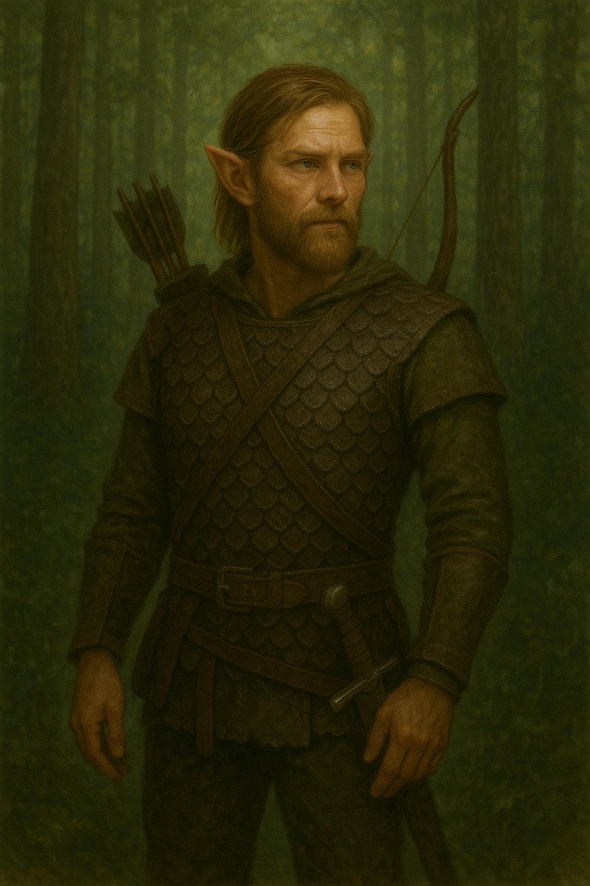

# D&D Characters

Welcome to my D&D character collection!

## Characters

### [Theren Vale - Wood Elf Ranger](ranger-character.md)

Folk Hero ranger with a complex backstory involving betrayal and hard-earned wisdom about trust and loyalty.

**Class**: Ranger (Level 1)  
**Race**: Wood Elf  
**Background**: Folk Hero  
**Personality**: ISTP - Stoic, practical, action-oriented

---

## Campaign Resources

### [Session Journal](sessions/)
Campaign notes, memorable moments, and character development tracking.

### [Party Dynamics](party-dynamics.md)
Relationships, trust levels, and group coordination notes.

### [Character Development](character-development.md)
Theren's personal growth, evolving perspectives, and key story moments.

---

*Built with GitHub Pages*